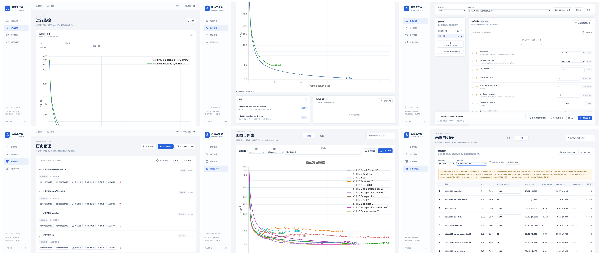

# AI Experiment · 实验工作台

[](https://github.com/Bruce-lhq/ai-exp-app/actions/workflows/ci.yml)

通过 SSH 管理训练任务，在本地查看日志、曲线和对比表。提供 macOS、Windows、Linux 桌面应用、CLI 与 localhost 网页入口；关闭工作台不影响远端任务和队列。绘图与列表读取本地缓存，可离线使用。

[](docs/images/workbench-overview.png)

## 最简单的开始方法

打开 Claude Code、Codex 或其他能操作终端的 AI Agent，把下面整段话复制给它：

```text
请克隆 https://github.com/Bruce-lhq/ai-exp-app.git，读取并加载 skills/experiment-workbench-setup/SKILL.md，按其指引帮我完成 AI Experiment 的安装与接入。
```

你只需要提供 Agent 询问的连接信息和代码位置；密码、私钥不用发到聊天里。没有现成实验时，可在确认后运行一个极小的验收任务。使用哪家云 GPU、目录怎么组织、训练用什么框架，都由 Agent 根据实际项目检查并接入；它需要能够访问对应代码和云端环境。

项目接入不限定训练框架、脚本名称或模型。Agent 根据实际代码生成 `workbench.project.json`，必要时适配配置与指标输出，并检查项目已有的严格续跑能力。

<details>
<summary>可选：把接入 SKILL 安装到 Agent 工具中</summary>

直接读取 [接入 SKILL](skills/experiment-workbench-setup/SKILL.md) 即可使用，无须安装。要作为命名 skill 使用，复制整个目录到工具的 skill 目录；保留 `references/` 和 `scripts/`，不要只复制 SKILL.md。

Claude Code 可使用项目目录 `.claude/skills/experiment-workbench-setup/`（[官方说明](https://code.claude.com/docs/en/skills)）；Codex 使用其当前版本支持的 skill 目录（[官方说明](https://developers.openai.com/codex/skills/)）。

</details>

## 功能

- 选择远端代码目录、Git 分支或版本，提交时固定代码快照。
- 命名参数组、JSON 导入／导出、参数备注、分类、排序及 K/M/B 数值输入。
- GPU 分配、可拖动队列、运行日志、实时曲线及确认暂停／停止。
- 手动导入本地或远端历史，刷新缓存、重命名、归档和导出；受管实验退出后补同步。
- 任意数值指标对比、PPL 对数坐标、图例及配色编辑、PNG 导出。
- 表格模板、baseline 差值、指标 min/max/final 及采样位置、Markdown 导出／复制。
- 原始超参数和指标只读；缺失参数可补填，备注可编辑，补充内容独立保存。
- 接入 Agent 验证项目现有完整状态续跑后，可从历史管理载入续跑到参数编辑区。

## 界面预览

顶部总览按两列、三行排列，点击可查看大图。截图展示一个训练项目的实际实验，参数和指标名称由该项目提供；个人路径和项目专用说明已做脱敏。

| 左列 | 右列 |
| --- | --- |
| [运行监控：实时曲线](docs/images/run-monitor-overview.png) | [运行监控：实验与队列](docs/images/run-monitor.png) |
| [配置实验](docs/images/experiment-configuration.png) | [历史管理](docs/images/history-management.png) |
| [曲线对比](docs/images/curve-comparison.png) | [实验列表](docs/images/experiment-table.png) |

## 安装与启动

### 独立桌面包与 CLI

从 [GitHub Releases](https://github.com/Bruce-lhq/ai-exp-app/releases) 下载对应系统的安装包或 CLI 压缩包。跨平台包为预览版；自动化验证记录随包发布，Windows 11 与 Linux 桌面的人工验收仍待完成。

| 系统 | 桌面安装包 | CLI 压缩包 |
| --- | --- | --- |
| macOS 13+ Apple Silicon | `AI-Experiment-macOS-arm64.dmg` | `AI-Experiment-CLI-macOS-arm64.tar.gz` |
| macOS 13+ Intel | `AI-Experiment-macOS-x86_64.dmg` | `AI-Experiment-CLI-macOS-x86_64.tar.gz` |
| Windows 11 x64 | `AI-Experiment-Windows-x64-Setup.exe` | `AI-Experiment-CLI-Windows-x64.zip` |
| Ubuntu 24.04 x64 | `AI-Experiment-Ubuntu-amd64.deb` | `AI-Experiment-CLI-Linux-amd64.tar.gz` |

- **Mac：**将应用拖入“应用程序”。使用系统 WebKit，可保留在程序坞。当前 ad-hoc 签名，尚未完成 Developer ID 公证；首次打开可能需按 [Apple 的说明](https://support.apple.com/102445) 在系统设置中允许。
- **Windows：**运行安装器，以当前用户安装。首次安装需要联网获取 Microsoft WebView2 Runtime；通过开始菜单或桌面图标打开。连接云端需系统 OpenSSH 客户端。
- **Ubuntu：**在下载目录运行 `sudo apt install ./AI-Experiment-Ubuntu-amd64.deb`，再从应用菜单打开。包会安装桌面库依赖；其他发行版尚未承诺兼容。

安装包和 CLI 压缩包自带 Python 与网页资源，无须另装 Python／Node。CLI 压缩包须完整解压，保留可执行文件旁的 `_internal` 目录；在解压目录执行 `./ai-experiment`（Windows PowerShell 使用 `.\ai-experiment.exe`），也可自行加入 PATH。Linux CLI 的绘图／服务操作不需要图形会话，桌面入口需要 Qt 系统库。

以下示例假设 `ai-experiment` 已在 PATH 中：

```bash
ai-experiment --help
ai-experiment service start
ai-experiment doctor
ai-experiment history list
```

`service start` 显示本机网页地址，默认 <http://127.0.0.1:8765>。桌面、网页、CLI 共用同一配置和缓存；重复启动复用自己的后台。升级后若提示旧版后台仍在运行，先停止本地服务再重新启动。关闭窗口保留本地服务，需要退出后台时执行 `ai-experiment service stop --yes`，远端训练与队列继续运行。首次设置可稍后完成，先导入本地历史。CLI 操作与离线出图见 [CLI 使用说明](docs/cli.md)。

### iPhone 主屏幕 Web App

源码版支持 GPU 本机代理模式和手机布局：网页后台运行在 GPU，iPhone 使用 VPN 与 SSH 本地端口转发访问，Mac 无需在线。仍只监听回环地址，并复用既有实验代理的状态和队列。已在 Ubuntu 20.04 GPU 上部署验证，并完成 iPhone 主屏幕 Web App 真机验收；现有 v0.4.1 发布包未包含此功能。部署步骤、缓存位置与限制见 [手机接入说明](docs/mobile-web.md)。

首次用 Safari 打开隧道入口 `http://127.0.0.1:8765`，点“分享”→“添加到主屏幕”，保留 **AI Experiment** 名称和“作为网页 App 打开”（若显示）。之后开启 VPN、Termius 隧道，点击主屏幕图标即可打开独立工作台窗口。无需安装原生 iOS 包或开发者签名。

### 从源码运行

要求 Python 3.12+、[uv](https://docs.astral.sh/uv/getting-started/installation/)、Node.js 22 和 npm。在专用项目目录安装，始终显式指定虚拟环境，避免修改其他 Python 环境。

```bash
git clone https://github.com/Bruce-lhq/ai-exp-app.git
cd ai-exp-app
uv venv --python 3.12
uv pip sync --python .venv/bin/python requirements.lock
uv pip install --python .venv/bin/python --no-deps -e .
npm --prefix web ci
npm --prefix web run build
.venv/bin/ai-experiment service start
```

Windows 将上述虚拟环境路径分别换成 `.venv/Scripts/python.exe`、`.venv/Scripts/ai-experiment.exe`。Windows PowerShell 可用正斜杠路径。

新工作空间使用系统应用数据目录；已有源码或应用工作空间会保留。要隔离开发环境，在启动前指定 `AI_EXP_DATA_DIR` 与 `AI_EXP_CONFIG_FILE`，见 [运行时配置](docs/runtime-configuration.md)。前端开发可另开终端运行 `npm --prefix web run dev`。

## 手动接入云端实验

使用 Agent 的用户可由它完成以下步骤。手动操作前，先按上文安装并启动本地应用。

### 1. 确认 SSH

工作台使用系统 SSH 配置和认证，不收集密码。先确认终端能连接 GPU 主机。示例 `~/.ssh/config`：

```sshconfig
Host gpu
    HostName gpu.example.com
    User your-user
    IdentityFile ~/.ssh/id_ed25519
    ControlMaster auto
    ControlPersist 10m
    ControlPath ~/.ssh/ai-exp-%C
```

Windows OpenSSH 配置只保留 Host、HostName、User、IdentityFile 和需要的 Port；上面的 ControlMaster／ControlPersist／ControlPath 仅用于支持连接复用的 Mac／Linux 客户端。

确认主机指纹后测试：

```bash
ssh gpu 'python3 --version; nvidia-smi'
```

远端代理需 Linux（含 `/proc`）和 Python 3.8+。GPU 调度默认使用 `nvidia-smi`；其他设备或提供商分配规则可由 Agent 配置 `remote_gpu_probe`，见 [云端环境接入](skills/experiment-workbench-setup/references/cloud-environments.md)。训练自身使用项目指定的环境，不要求 PyTorch。代码与数据需放在远端，如何上传及安装项目依赖见接入 SKILL。

### 2. 设置工作空间并安装代理

在应用“工作空间设置”填自己的路径：

| 设置 | 示例 |
| --- | --- |
| SSH 别名 | `gpu` |
| 云端工作台目录 | `/your_exp/workbench` |
| 云端代码目录 | `/your_exp/projects/` |
| 云端实验目录 | `/your_exp/runs/` |
| 云端 Python | `/your_exp/venv/bin/python` |
| 云端数据目录 | 可留空；由项目命令或参数指定 |
| 本地实验导入目录 | `~/gpu_downloads/` |

桌面安装包中的 CLI 和独立 CLI 均包含远端代理。保存工作空间设置后，使用同一工作空间的 CLI 安装：

```bash
ai-experiment install-agent --read-only
ai-experiment install-agent
```

`--read-only` 也会连接并部署代理，但使远端代理拒绝启动／停止等写操作，适合先检查接入；检查后重新执行不带该选项的安装命令启用完整功能。源码版用 `.venv/bin/ai-experiment`（Windows 用 `.venv/Scripts/ai-experiment.exe`）。显式选择了环境变量工作空间时，安装代理也使用相同的变量。

安装器原子更新标准库 zipapp，不重建队列或训练状态。详细字段见 [运行时配置](docs/runtime-configuration.md)。

### 3. 声明训练项目

在云端代码目录放置 `workbench.project.json`。完整格式和可运行小示例见 [项目接入协议](docs/project-integration.md)。启动命令使用 argv 数组，每个参数独立一项；不通过 shell 展开。普通脚本、多进程启动器、其他可执行程序均可声明。

在“配置实验”添加该云端代码目录，选择工作树或 Git 版本。工作台读取该版本的项目声明，显示默认参数，提交时冻结代码和配置。先以小模型或小步数验证参数、输出和 GPU 使用，再运行正式任务。

### 4. 导入已有实验

“历史管理”导入包含 `args.json`、`metrics.jsonl`、`train.log` 的本地或云端目录；文件可缺失，会提示，不会补零。`metrics.jsonl` 支持任意有限数值指标及 `step`、`tokens_seen`、`elapsed_s` 横轴；不会要求特定模型指标。其他格式先按接入 SKILL 转换到新的标准目录，保留原始文件。

到“画图与列表”勾选历史、选择指标与可用横轴，下载 PNG／Markdown。远端文件变化后在历史管理点击“同步最终文件”；绘图不自动访问云端。

### 5. 暂停与严格续跑

暂停／停止需确认，使用进程身份检查；不会要求训练程序主动保存新 checkpoint。外部进程接管目前只支持可识别的 torchrun 进程与可选的终端分组工具；普通项目应由工作台启动才能可靠控制。

接入 Agent 先检查项目已有的保存／恢复代码；若已支持严格续跑，就复用现有校验或生成与项目格式匹配的验证器，配置后可在历史管理点击“载入续跑到编辑区”。验证器应校验模型、优化器、调度器、随机数、数据游标，以及代码／数据／参数／GPU 数兼容性；仅保存权重不够。结果写入新的实验目录，来源保留。尚未配置校验器时会提示需要检查并完成接入，这不代表项目不支持；Agent 应继续核实，而不是直接关闭此功能。本地历史不能直接作为云端续跑来源。

## 架构

```text
Mac WebKit / Windows Edge / Linux Qt / 浏览器
                       |
              React + Chart.js 前端
                       |       CLI
                       |        |
              本地 FastAPI 服务 + PNG 导出
              SQLite + 文件缓存
                       |
                   系统 SSH
                       |
               远端 Python zipapp
            代码快照 / GPU 队列 / 进程管理
                       |
          项目声明的训练命令与输出协议
```

| 目录 | 职责 |
| --- | --- |
| `web/` | React 页面、Chart.js、参数与表格编辑 |
| `src/ai_exp_app/` | API、SQLite、SSH、历史同步、指标统计 |
| `remote/ai_exp_remote/` | 远端代理、调度、进程管理、快照、项目声明与续跑验证 |
| `macos/AIExperiment/`、`src/ai_exp_app/native.py` | 原生窗口、聚焦、文件选择及系统通知 |
| `skills/experiment-workbench-setup/` | Agent 接入流程、检查脚本与参考资料 |
| `examples/` | 无训练框架依赖的最小接入示例 |
| `scripts/` | 跨平台构建、安装包验收与工作空间迁移 |
| `tests/`、`web/tests/` | 后端、前端与浏览器回归 |

远端保存训练文件与队列；本地保存项目、参数组、历史索引、图表／表格偏好和缓存。断线保留缓存，重连补同步。提交时固定代码与参数，后续编辑不改变已提交任务。

本地 API 仅供本机使用，具备会话、同源与原生应用令牌检查。项目命令和可选 checkpoint 验证器是用户选择的可执行代码；只接入可信项目。工作台不提供不可信代码沙箱或多人公网服务。

## 开发与测试

### 运行测试

```bash
.venv/bin/python -m pytest -q
npm --prefix web test
npm --prefix web run build
cd web
npx playwright install chromium
npm run test:e2e
```

CI 使用临时目录、模拟远端接口和小型普通命令测试，不需要连接真实 GPU 或配置 SSH。GitHub Actions 在 Linux、Windows Server、两种 Mac 架构执行后端测试，Linux 执行前端测试与 Chromium 回归；包构建流程另测冻结 CLI、离线导出与真实原生渲染器。Windows Server CI 不等同于 Windows 11 人工验收。

### 构建桌面与 CLI

在目标系统／架构上构建，不能在 Mac 上冻结 Windows 或 Linux 可执行文件。先安装对应桌面依赖和 PyInstaller：

```bash
uv pip sync --python .venv/bin/python requirements-desktop.lock
uv pip install --python .venv/bin/python --no-deps -e .
uv pip install --python .venv/bin/python PyInstaller==6.22.3
```

Mac 安装 Xcode Command Line Tools 后运行 `.venv/bin/python scripts/build_macos.py`；Windows 安装 NSIS 后运行 `.venv/Scripts/python.exe scripts/build_desktop.py`；Ubuntu 安装包流程见 [发布说明](docs/releasing.md)。产物位于 `dist/releases/`，发布到 GitHub Releases，不进入 Git。

## Future work

- 应用内自动检查 SSH、上传代码与安装代理；当前通过接入 SKILL 完成。
- TensorBoard／其他指标存储的原生接入；当前使用标准 JSONL 或转换脚本。
- 更广泛的外部进程接管和其他 GPU／调度系统支持。
- Developer ID 签名与公证、Windows 代码签名，以及 Windows 11／Linux 桌面人工验收与更多系统覆盖。
- 按项目能力在暂停前保存 checkpoint，展示恢复点与可能损失的进度。
- 多 seed／参数扫描、分组统计与工作空间备份。

## License

[MIT](LICENSE)。第三方依赖保留各自许可证；各平台包包含项目许可证与第三方许可证清单。
