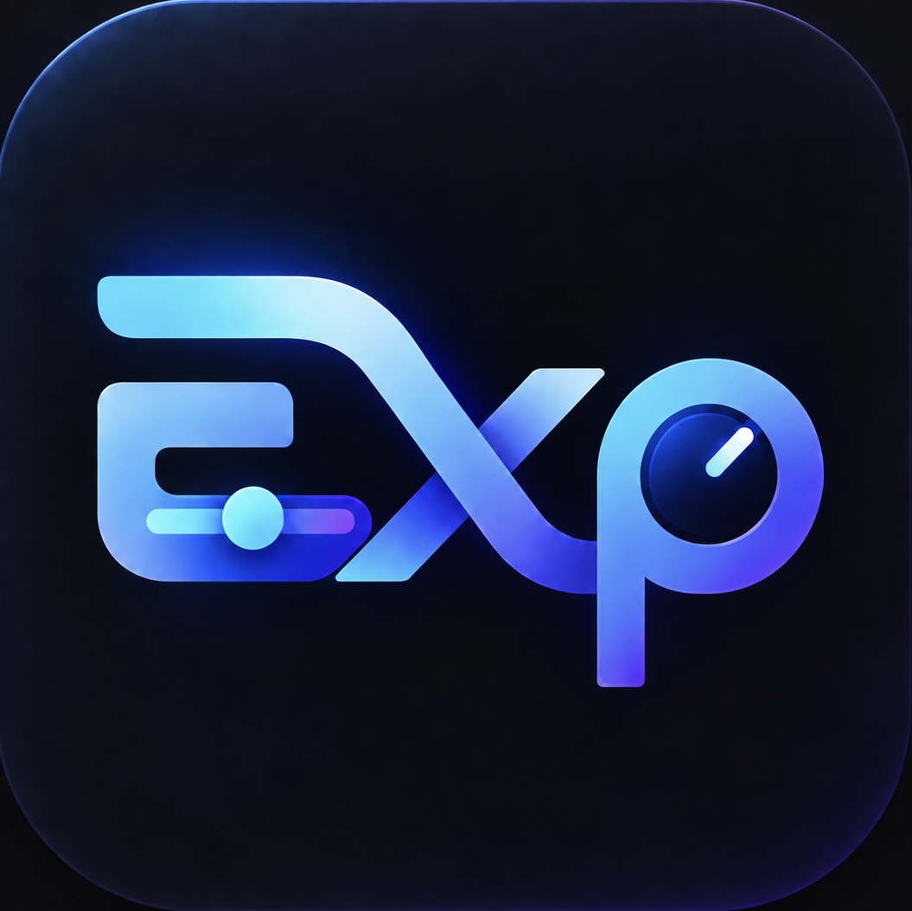

# AI Experiment · 实验工作台



[](https://github.com/Bruce-lhq/ai-exp-app/actions/workflows/ci.yml)

通过 SSH 管理训练任务，在本地查看日志、曲线和对比表。提供 macOS、Windows、Linux 桌面应用、CLI 与 localhost 网页入口；关闭工作台不影响远端任务和队列。桌面绘图与列表读取本地缓存，可离线使用；iPhone 通过 SSH 隧道访问 GPU 常驻后台。

[](docs/images/workbench-overview.png)

## 最简单的开始方法

打开 Claude Code、Codex 或其他能操作终端的 AI Agent，把下面整段话复制给它：

```text
请克隆 https://github.com/Bruce-lhq/ai-exp-app.git，读取并加载 skills/experiment-workbench-setup/SKILL.md，按其指引帮我完成 AI Experiment 的安装与接入。
```

你只需要提供 Agent 询问的连接信息和代码位置；密码、私钥不用发到聊天里。没有现成实验时，可在确认后运行一个极小的验收任务。使用哪家云 GPU、目录怎么组织、训练用什么框架，都由 Agent 根据实际项目检查并接入；它需要能够访问对应代码和云端环境。

项目通过 `workbench.project.json` 声明训练命令、参数与输出；不同结构可能需要 Agent 编写适配，不限定训练框架或模型。严格续跑由 Agent 检查项目的实际保存与恢复能力。

接入 SKILL 可直接读取，无须安装。

## 功能

- 远端代码目录与 Git 版本选择，提交时固定代码快照和参数。
- 命名参数组、JSON 导入／导出、备注、分类、排序及 K/M/B 数值输入。
- GPU 分配、可拖动队列、日志与实时曲线、确认暂停／停止；验证项目能力后严格续跑。
- 历史导入、同步、重命名、归档与导出；原始超参数和指标只读，缺失字段与备注可补填。
- 任意数值指标对比、PPL 对数坐标、图例与配色编辑、PNG 导出；支持系统／浅色／深色外观，PNG 保留白底。
- 表格模板、baseline 差值、指标 min/max/final 及采样位置、Markdown 导出／复制。

## 界面预览

总览采用两列、三行排列。截图中的参数和指标由示例训练项目提供。

<details>
<summary>查看单张截图</summary>

| 左列 | 右列 |
| --- | --- |
| [运行监控：实时曲线](docs/images/run-monitor-overview.png) | [运行监控：实验与队列](docs/images/run-monitor.png) |
| [配置实验](docs/images/experiment-configuration.png) | [历史管理](docs/images/history-management.png) |
| [曲线对比](docs/images/curve-comparison.png) | [实验列表](docs/images/experiment-table.png) |

</details>

## 安装与启动

### 独立桌面包与 CLI

从 [GitHub Releases](https://github.com/Bruce-lhq/ai-exp-app/releases) 下载对应系统的安装包或 CLI 压缩包。`v0.5.0` 为常规发布。Mac Apple Silicon 与 iPhone 已完成真机验收；Windows、Ubuntu 和 Mac Intel 包经过自动验证，仍按实验性支持提供。自动验证记录与校验值随包发布。

| 系统 | 桌面安装包 | CLI 压缩包 |
| --- | --- | --- |
| macOS 13+ Apple Silicon | `AI-Experiment-macOS-arm64.dmg` | `AI-Experiment-CLI-macOS-arm64.tar.gz` |
| macOS 13+ Intel | `AI-Experiment-macOS-x86_64.dmg` | `AI-Experiment-CLI-macOS-x86_64.tar.gz` |
| Windows 11 x64 | `AI-Experiment-Windows-x64-Setup.exe` | `AI-Experiment-CLI-Windows-x64.zip` |
| Ubuntu 24.04 x64 | `AI-Experiment-Ubuntu-amd64.deb` | `AI-Experiment-CLI-Linux-amd64.tar.gz` |

- **Mac：**将应用拖入“应用程序”。使用系统 WebKit，可保留在程序坞。当前 ad-hoc 签名，尚未完成 Developer ID 公证；首次打开可能需按 [Apple 的说明](https://support.apple.com/102445) 在系统设置中允许。
- **Windows：**运行安装器，以当前用户安装。首次安装需要联网获取 Microsoft WebView2 Runtime；通过开始菜单或桌面图标打开。连接云端需系统 OpenSSH 客户端。
- **Ubuntu：**在下载目录运行 `sudo apt install ./AI-Experiment-Ubuntu-amd64.deb`，再从应用菜单打开。包会安装桌面库依赖；其他发行版尚未承诺兼容。

安装包和 CLI 压缩包自带 Python 与网页资源，无须另装 Python／Node。CLI 压缩包须完整解压，保留可执行文件旁的 `_internal` 目录；在解压目录执行 `./ai-experiment`（Windows PowerShell 使用 `.\ai-experiment.exe`），也可自行加入 PATH。Linux CLI 的绘图／服务操作不需要图形会话，桌面入口需要 Qt 系统库。

CLI／网页入口（假设 `ai-experiment` 已在 PATH 中）：

```bash
ai-experiment service start
ai-experiment --help
```

`service start` 显示本机网页地址，默认 <http://127.0.0.1:8765>。桌面、网页、CLI 共用同一工作空间；关闭窗口不会停止远端训练与队列。更多命令见 [CLI 使用说明](docs/cli.md)。

### iPhone 主屏幕 Web App

网页后台运行在 GPU，手机通过 iSH 的 SSH 隧道访问，Mac 无需在线。**iSH → iPhone 主屏幕 Web App 的真机验收已完成。**手机入口从源码部署；桌面安装包不会自动在 GPU 部署网页后台。

先让接入 Agent 按 [GPU 后台部署说明](docs/mobile-web.md#1-准备后台)准备常驻服务，确认 GPU 上 `http://127.0.0.1:8765/api/health` 返回工作台 JSON。手机需能独立访问 GPU 的 SSH 地址。

安装 [iSH](https://ish.app/)，在其中执行下面几行。把 `your-user@gpu.example.com` 和 `22` 换成自己的 SSH 用户、主机和端口：

```sh
apk update
apk add openssh-client curl
ssh -fN -o ExitOnForwardFailure=yes -o ServerAliveInterval=15 -o ServerAliveCountMax=3 -L 127.0.0.1:8765:127.0.0.1:8765 -p 22 your-user@gpu.example.com
curl --max-time 10 http://127.0.0.1:8765/api/health
```

首次连接核对主机指纹，按提示输入密码或使用自己的 SSH 密钥；认证完成后隧道转入后台。看到工作台 JSON 后，用 Safari 打开 `http://127.0.0.1:8765`，点“分享”→“添加到主屏幕”，名称保留 **AI Experiment**，“作为网页 App 打开”（若显示）保持开启。以后先在 iSH 建立隧道，再点主屏幕图标；无需原生 iOS 安装包或开发者签名。隧道已正常工作时不必重复执行启动命令。

如需切换到工作台后保持 iSH 后台运行，可按 [iSH 官方说明](https://github.com/ish-app/ish/wiki/Running-in-background)授予位置权限，再执行：

```sh
cat /dev/location > /dev/null &
```

iOS 回收或强制关闭 iSH 后需要重建隧道；SSH 心跳不能代替后台运行。GPU 实验不受手机断线影响。手机的历史缓存和配置保存在 GPU，与 Mac 的缓存独立；数据位置及故障排查见 [详细说明](docs/mobile-web.md#4-数据位置与人工验收)。

### 从源码运行

要求 Python 3.12+（含 venv 和 pip）、Node.js 22 和 npm；不需要安装 uv。在专用项目目录安装，始终显式指定虚拟环境，避免修改其他 Python 环境。

```bash
git clone https://github.com/Bruce-lhq/ai-exp-app.git
cd ai-exp-app
python3 -m venv .venv
.venv/bin/python -m pip install -r requirements.lock
.venv/bin/python -m pip install --no-deps -e .
npm --prefix web ci
npm --prefix web run build
.venv/bin/ai-experiment service start
```

Windows 用 `py -3.12 -m venv .venv` 创建环境，并将上述虚拟环境路径分别换成 `.venv/Scripts/python.exe`、`.venv/Scripts/ai-experiment.exe`。Windows PowerShell 可用正斜杠路径。

工作空间路径与隔离方法见 [运行时配置](docs/runtime-configuration.md)；开发、测试和构建见 [贡献指南](CONTRIBUTING.md)。

## 首次使用

让接入 Agent 检查项目并完成配置后，在“配置实验”选择项目和参数；在“历史管理”导入已有实验，到“画图与列表”比较结果。没有已有实验时，可授权一个极小验收任务。更新远端结果时，在历史管理同步缓存。

手动接入见 [接入指南](docs/getting-started.md)。严格续跑需验证项目的完整状态恢复能力；外部进程接管范围与输出协议见 [项目接入说明](docs/project-integration.md)。

## 架构

```text
桌面／CLI／本机浏览器 → 本机后台与缓存 → SSH → GPU 实验代理
                                                   ↓
iPhone 主屏幕 Web App → SSH 隧道 → GPU 后台与缓存 → 同一实验代理
                                                   ↓
                                          项目训练命令与输出
```


| 目录 | 职责 |
| --- | --- |
| `web/` | React 页面、Chart.js、参数与表格编辑 |
| `src/ai_exp_app/` | API、SQLite、SSH、历史同步、指标统计 |
| `remote/ai_exp_remote/` | 远端代理、调度、进程管理、快照、项目声明与续跑验证 |
| `macos/AIExperiment/`、`src/ai_exp_app/native.py` | 原生窗口、聚焦、文件选择及系统通知 |
| `skills/experiment-workbench-setup/` | Agent 接入流程、检查脚本与参考资料 |
| `examples/` | 无训练框架依赖的最小接入示例 |
| `scripts/` | 跨平台构建、安装包验收与工作空间迁移 |
| `tests/`、`web/tests/` | 后端、前端与浏览器回归 |

手机模式将前端静态文件、FastAPI 与缓存放在 GPU，通过手机 SSH 隧道访问；后台在 GPU 本机调用同一远端代理，无需绕回 Mac。

远端保存训练文件与队列；后台所在主机保存项目、参数组、历史索引、图表／表格偏好和缓存。断线保留缓存，重连补同步。提交时固定代码与参数，后续编辑不改变已提交任务。

本地 API 仅供本机使用，具备会话、同源与原生应用令牌检查。项目命令和可选 checkpoint 验证器是用户选择的可执行代码；只接入可信项目。工作台不提供不可信代码沙箱或多人公网服务。

## 文档与反馈

- [手动接入](docs/getting-started.md) · [项目协议](docs/project-integration.md) · [运行时配置](docs/runtime-configuration.md)
- [CLI](docs/cli.md) · [GPU 手机后台](docs/mobile-web.md) · [Agent 接入 SKILL](skills/experiment-workbench-setup/SKILL.md)
- [贡献与测试](CONTRIBUTING.md) · [构建与发布](docs/releasing.md)
- 遇到问题或希望增加功能，请到 [GitHub Issues](https://github.com/Bruce-lhq/ai-exp-app/issues) 提供版本、系统和脱敏后的复现信息。

发行与验收仍包括 Developer ID 公证、Windows 代码签名，以及其他桌面平台的人工验收。

## Future work

- 应用内一站式 SSH 诊断、代码上传与代理安装；当前完整接入流程通过 SKILL 完成。
- TensorBoard／其他指标存储的原生接入；当前使用标准 JSONL 或转换脚本。
- 更广泛的外部进程接管，以及更多设备／调度系统的开箱即用适配；当前可声明训练命令并配置设备探测。
- 按项目能力在暂停前保存 checkpoint，展示恢复点与可能损失的进度。
- 多 seed／参数扫描、分组统计与工作空间备份。

## License

[MIT](LICENSE)。第三方依赖保留各自许可证；各平台包包含项目许可证与第三方许可证清单。
